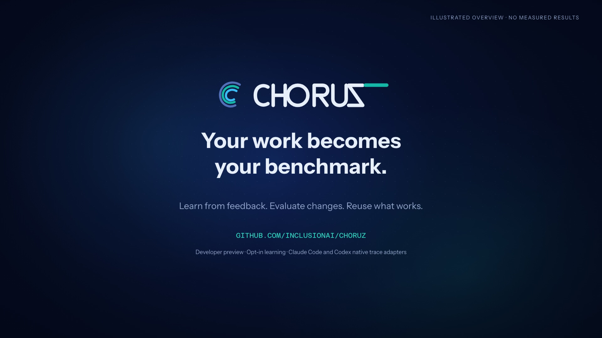

# Choruz: Your work becomes your benchmark

An English illustrated overview of Choruz's personalized learning workflow, with one actual product-settings capture.

[Watch or download the video](choruz-learning-overview.mp4)

The film explains real feedback → asynchronous analysis → personalized benchmark cases → prompt-first harness adaptation → bounded team changes → selective use of a configured smaller provider model. It does not report measured gains, latency or cost savings.

Claude Code and Codex have native trace-learning adapters. Muse runs as an official CLI workspace, but its native learning adapter is not included in the demonstrated revision. Learning is opt-in and consumes the selected account's usage.

## Production and evidence

Opus 5.5 created the narrative, storyboard, palette and initial renderer assets. Codex implemented the motion renderer, incorporated a real settings capture, encoded the film and verified decoded frames. The actual supported Claude effort was **max**, not ultra; the installed CLI does not support ultra for this model.

The real capture came from an isolated local workspace running revision `0e0401b90bd21bc547209d8142335227b1a9210d`. An official Claude Code CLI answered a benign example issue, then accepted a user's English/JSON-format correction. The screenshot shows the user enabling learning and selecting an analysis agent. Background analysis later reported failure, so no completed analysis, successful benchmark or measured improvement is claimed. The demo learning policy was subsequently disabled.

Generated media lives on this separate media branch rather than the main source history. The private raw production logs and full browser captures are not published.

See [provenance](provenance.json) for format, source revision and verification, and [third-party notices](THIRD_PARTY_NOTICES.md) for artwork and font licenses.
