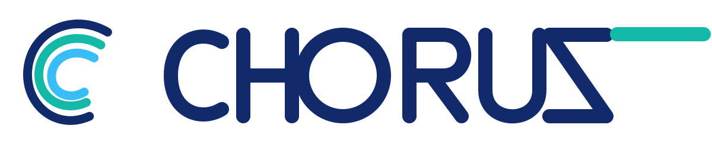

<p align="center">
  <picture>
    <source media="(prefers-color-scheme: dark)" srcset="assets/brand/signal-chorus-lockup-dark.svg">
    
  </picture>
</p>

<h1 align="center">Choruz — An Agent Workspace That Learns From Your Work</h1>

An agent workspace for **Codex, Claude Code, and Muse** that asynchronously turns user interaction traces into **personalized benchmarks** to adapt harnesses, reduce recurring errors, and support selective substitution with **smaller provider models you configure**.

Native trace learning currently supports **Codex and Claude Code**. Muse workspace execution is supported; its native learning adapter is not included yet. Choruz evaluates task suitability, not a provider model's parameter count or billing cost.

Keep working with your agent. With background learning enabled, Choruz uses task outcomes, tool feedback, and your corrections to build evaluable tasks and test proposed improvements. The agent's instructions and execution team can change; the analysis and evaluation standards stay fixed. This adapts the harness, not the model's weights.

Choruz supports Claude Code, Codex, Muse Code, and webhook-driven external agents by default. Plugins enable Grok, Pi, OpenCode, and MathCode; see [plugin configuration](docs/plugins.md).

## Demo

[](https://github.com/inclusionAI/Choruz/raw/93ea9787b6bc8865cebdeb9a6f4f2fc732c90cd9/choruz-learning-overview.mp4)

[Watch the 1:57 English overview](https://github.com/inclusionAI/Choruz/raw/93ea9787b6bc8865cebdeb9a6f4f2fc732c90cd9/choruz-learning-overview.mp4) · [Production and provenance](https://github.com/inclusionAI/Choruz/tree/93ea9787b6bc8865cebdeb9a6f4f2fc732c90cd9)

Illustrated mechanisms with one actual product-settings capture; no measured improvement or cost saving is claimed.

## Developer Preview

Choruz is under pre-release development. Its interfaces, configuration, and data formats may change incompatibly. Before upgrading an existing installation, follow the [offline conversion guide](docs/testing/choruz-runtime-conversion-rehearsal.md).

## From Interaction to Improvement

```text
Your task + agent actions + real feedback
                    ↓
          Background trace analysis
                    ↓
         Personalized benchmark cases
                    ↓
       Evaluate prompt and team changes
                    ↓
   Apply reviewed improvements to future tasks
                    ↓
  Reuse a validated program with your configured provider model
```

- **Learn from your actual work.** Meaningful work segments retain attempts, outcomes, and later corrections. An unsuccessful exploration is not automatically an agent mistake.
- **Turn experience into tests.** Cases carry an input, expected outcome, and an exact check or independent AI judge. Curated training, validation, and held-out cases keep evaluation separate from optimization.
- **Improve the harness, not the scorecard.** Prompt changes come first. A documented recurrence after guidance was used can unlock changes to collaborator count, role prompts, and execution order. Reviewed revisions can be restored or cleared.
- **Use a configured smaller model selectively.** When you select a smaller provider model, a validated finite-output program can complete applicable turns without native inference if you enable that capability. Abstentions and provider failures return to the original agent; this is not blanket replacement of arbitrary tasks or a guaranteed cost saving.

Enable background learning, choose an analysis agent, and set the evaluation and application permissions in **Experience learning**. Analysis runs in separate asynchronous sessions and consumes the selected account's usage; foreground work keeps its current instructions. Provider-program execution additionally requires the configured provider and explicit transmission permission.

The same [learning](crates/choruz-learning/README.md), [evaluation](crates/choruz-evaluation/README.md), and [decision](crates/choruz-decision/README.md) libraries can be used independently of the full workspace.

## Run

### Requirements

- Rust, pinned by [`rust-toolchain.toml`](rust-toolchain.toml)
- Node.js 24 ([`.nvmrc`](.nvmrc)) and pnpm 10
- PostgreSQL 16
- At least one supported agent CLI

### Run from source

```bash
git clone https://github.com/inclusionAI/Choruz.git
cd Choruz
pnpm install
pnpm dev:all
```

Start the Web app in another terminal:

```bash
pnpm dev:web
```

The command prints the URL to open. The main checkout uses `http://127.0.0.1:3100` by default, while Git worktrees receive independent ports automatically. Choose a project in the task workbench and start a task with an installed agent CLI. Use **Configure device, account or agent** for additional setup; collaboration and group conversations remain available from the workspace controls.

Stop the Web app and Choruz services:

```bash
pnpm stop:all
```

## Core Capabilities

- **Personalized evaluation:** Background trace analysis, feedback-grounded benchmark cases, fixed checks and judges, and measured prompt/team optimization.
- **Selective provider-model execution:** Use a smaller model you configure through evaluated decision programs, with confidence/applicability checks, native fallback, and recorded model attribution.
- **A familiar workspace:** Real CLI agents, persistent tasks, project files, and local or remote execution devices. Collaboration, groups, threads, and task boards remain available when needed.
- **Composable capabilities:** Shared libraries, REST APIs, WebSocket sync, webhook agents, optional plugins, and Slack/Telegram bridges.

## Documentation

After starting the Web app, open `/docs` for the user guide. Its source is under [`apps/web/app/docs`](apps/web/app/docs). Continue with these engineering and integration references:

- [Architecture overview](docs/architecture.md) and [subsystem index](docs/subsystems/README.md)
- [Remote control](docs/operations/remote-control.md) and the [CLI](docs/operations/cli.md)
- [OpenAPI contract](openapi/choruz.yaml) and [plugin development](docs/plugins.md)
- [Contributing guide](CONTRIBUTING.md), [engineering rules](AGENTS.md), and [security reporting](SECURITY.md)

## Contributors

<p>
  <a href="https://github.com/jcguo123"></a>
  <a href="https://github.com/DPLL"></a>
  <a href="https://github.com/hsz0403"></a>
  <a href="https://github.com/jasonge27"></a>
</p>

Contributors appear in the order defined in [`CONTRIBUTORS.md`](CONTRIBUTORS.md).

## License

Source code and software documentation are distributed under the [Apache License 2.0](LICENSE), with incorporated-code notices retained in [NOTICE](NOTICE). Dependencies and agent CLIs retain their own licenses and service terms. Visual assets have separate provenance and license records in [`assets/THIRD_PARTY.md`](assets/THIRD_PARTY.md) and [`assets/brand/README.md`](assets/brand/README.md). This license does not grant rights to the Choruz name or product identity.
